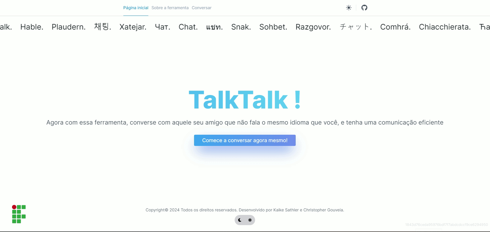

# Protótipo do Projeto Integrador III

## Neste repositório, está as imagens do protótipo do nosso projeto integrador, cujo trabalho é intitulado **Desenvolvimento de uma ferramenta web de um chat de tradução em tempo real**. Para mais informações, acesse a proposta preliminar do projeto: https://docs.google.com/document/d/13ryA-Utfj5ouYbIKUlEYyugg4_PqLVBTcaTeL3rk6xY/edit?usp=sharing

