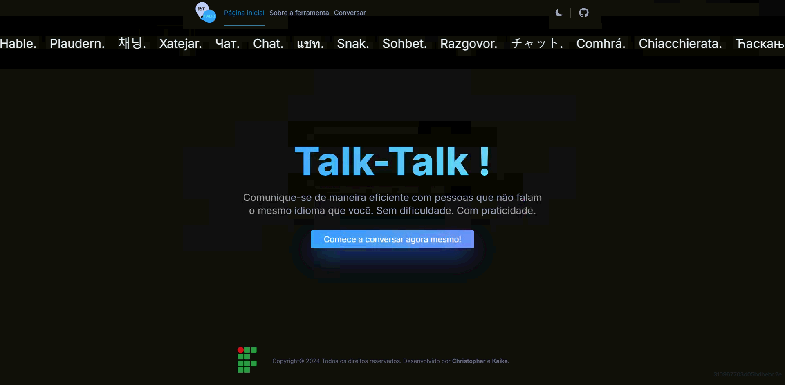
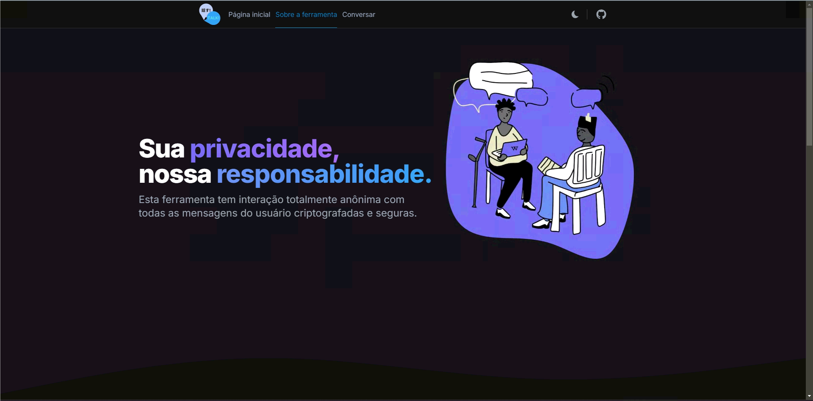
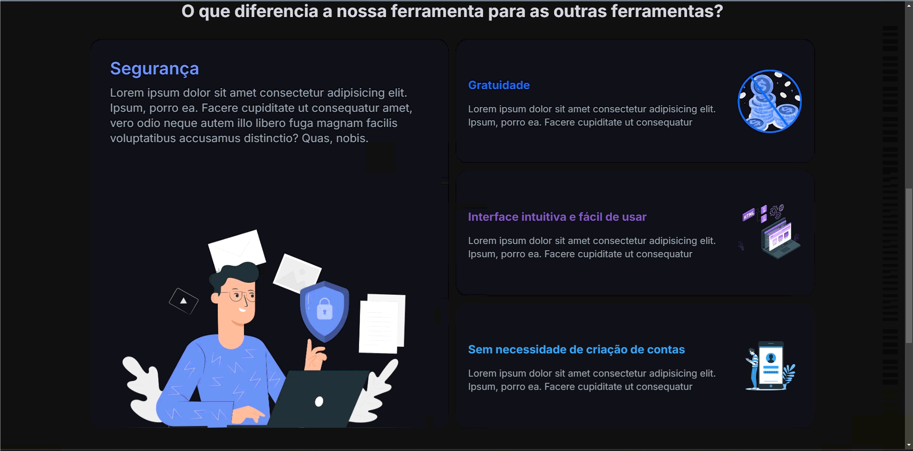
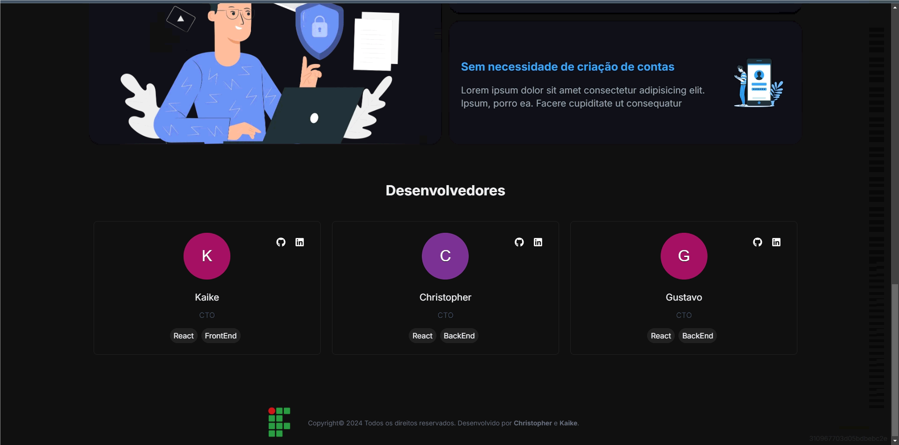
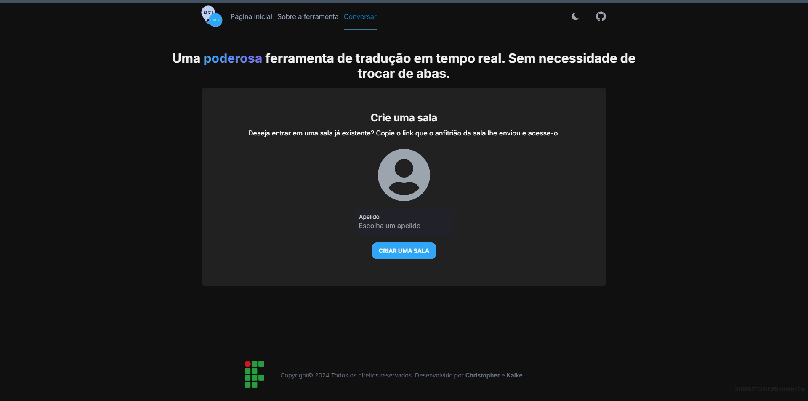
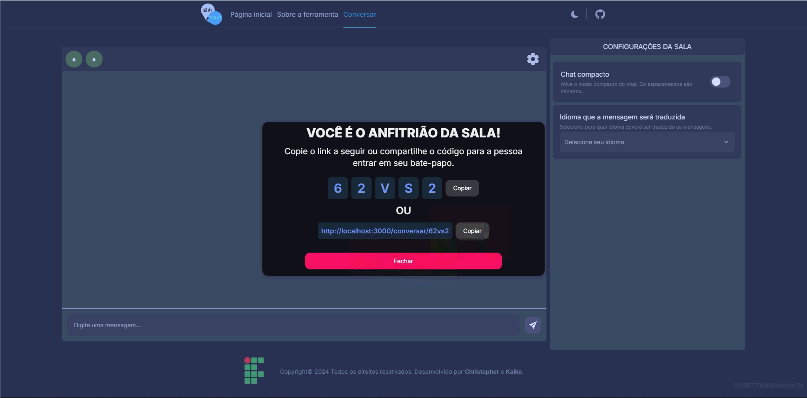
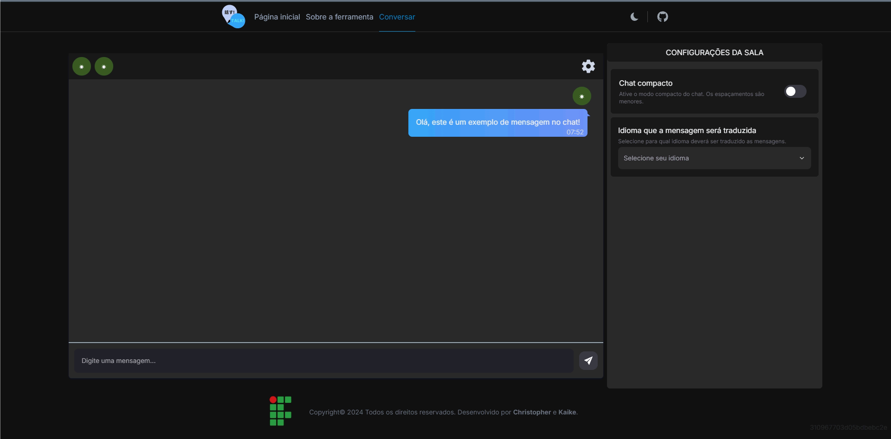
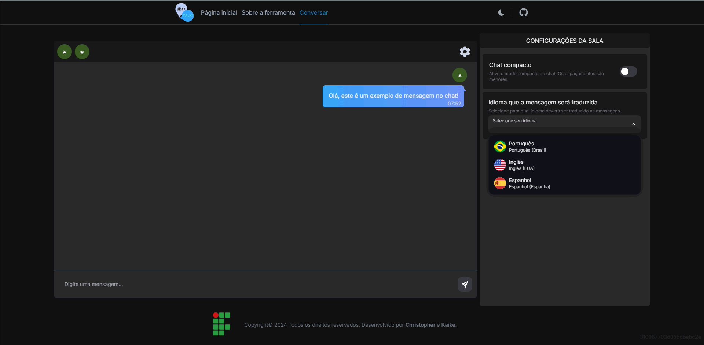

# Protótipo do Projeto Integrador III

## Neste repositório, está as imagens do protótipo do nosso projeto integrador, cujo trabalho é intitulado "**Desenvolvimento de uma ferramenta web de um chat de tradução em tempo real**". Para mais informações, acesse a proposta preliminar do projeto: https://docs.google.com/document/d/13ryA-Utfj5ouYbIKUlEYyugg4_PqLVBTcaTeL3rk6xY/edit?usp=sharing

# Imagens e descrição detalhada

Página de apresentação do projeto. As cores pensadas para o site todos foi visada em alegria e conforto, e as melhores escolhas para garantir estes foi: azul, cinza, branco e roxo. Pelos significados de cara uma das cores no mundo da psicologia, tais como transmitir alegria. Na página vemos o título em azul e maior que a fonte comum, desejando passar ao usuário o objetivo do site e seu título.

Página onde contém detalhes e propósito do projeto. No título e na imagem foi utilizada a mescla das cores para passar ao usuário uma sensação de segurança e confiança ao nosso site, induzindo também ele a ler detalhes sobre o projeto.

Página onde contém as diferenças do nosso site para os outros similares. Esta pagina propõe motivos para o usuário utilizar a ferramenta e confiar nela para o cotidiano social. Também, mais abaixo do site, contém a parte dos desenvolvedores do site.

Página de criação das salas virtuais que levará para um chat virtual, estilo whatsapp.

Modal contendo o código da sala para o anfitrião compartilhar ao seu convidado.

Página que contém a visualização das mensagens do chat que virão traduzidos utilizando Google Translator API, juntamente a estes, a opção de modificar a aparência do website, descritas na barra lateral.

### Alunos: Christopher Rodrigues Gouveia e Kaike da Silva Sathler
